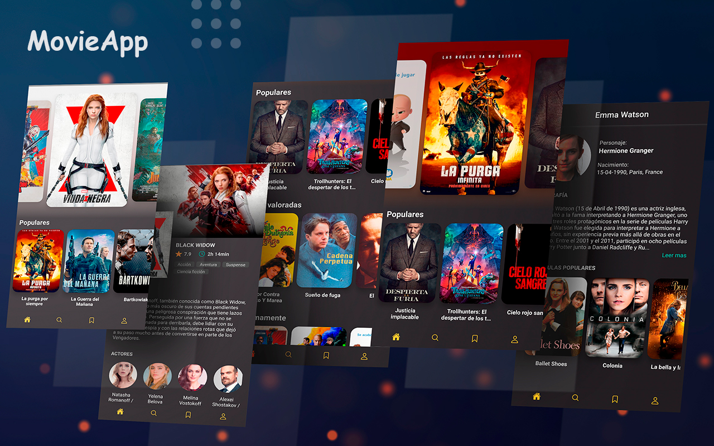

# Movie App
Mobile application of movies that allows you to see which are the new releases, the most popular of the moment, about to come out and more.

### Preview  


### Running the app
Clone/download the project and run `yarn install` to build the dependencies the project needs.

Install the React Native command line interface.
```
npm install -g react-native-cli
```

#### Development
```
// Inside the downloaded folder

// To start Metro Bundler
npx react-native start

// Launch app on emulator or device
npx react-native run-android
npx react-native run-ios
```
### Features
* Animated main background
* Extract colors from images
* Get the most current and popular movies
* Obtain information from the actors

### Notes
This application uses the [themoviedb](https://api.themoviedb.org) API which requires you to use your own **API_KEY** to make requests.

### License
Released under the [MIT licensed](https://mit-license.org/).